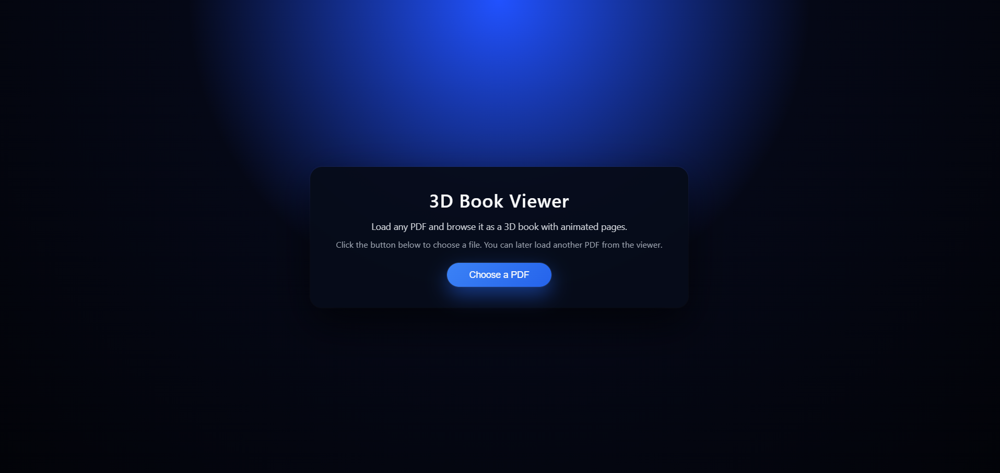
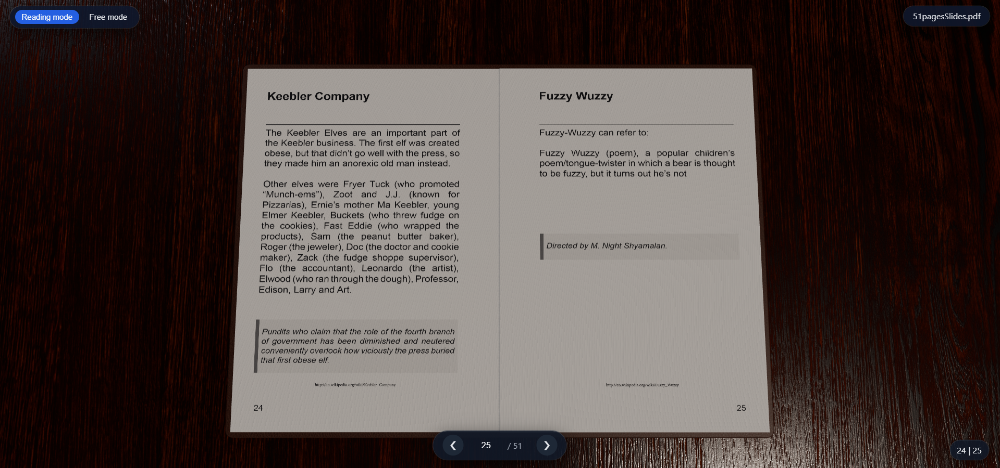
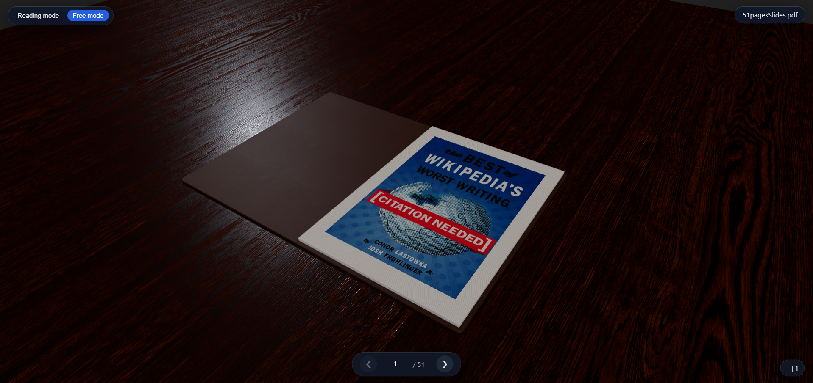

# 3D Book Viewer

A 3D PDF viewer built with Three.js and PDF.js. Load a PDF file and browse it as a book with page-turning animations.

## 📖 About

This application renders PDF documents in a 3D environment. The book sits on a textured wood table with lighting and shadows. Two camera modes are available: a fixed reading mode and a free exploration mode.

## ✨ Features

- Load any PDF from your local system
- Animated page flips with deformation
- Two camera modes (reading / free)
- Textured environment (book, table)
- Lighting and shadows
- Keyboard and UI controls
- Page navigation

## 🛠️ Technologies

- **[Three.js](https://threejs.org/)** - 3D graphics rendering
- **[PDF.js](https://mozilla.github.io/pdf.js/)** - PDF parsing and rendering
- **Vanilla JavaScript** (ES6 modules)
- **HTML5 Canvas** - Texture generation
- **Git LFS** - Large file storage for textures

## 📸 Screenshots


_Loading a PDF file_


_Reading mode with fixed camera_


_Free mode with orbit controls_

## 📋 Prerequisites

- A web browser (Chrome, Firefox...)
- A local web server (see installation options below)
- **Git LFS** installed (for texture files)

## 🚀 Installation & Setup

### 1. Clone the repository

```bash
git clone <your-repo-url>
cd 3d-book-viewer
```

### 2. Install Git LFS and pull assets

```bash
git lfs install
git lfs pull
```

This will download all texture files stored in the `assets/` folder.

To verify Git LFS is working:

```bash
git lfs ls-files
```

### 3. Start a local server

**Option A: VS Code Live Server (Recommended)**

1. Install the **Live Server** extension in VS Code
2. Open this project folder in VS Code
3. Right-click `index.html` → **Open with Live Server**

**Option B: Python**

```bash
python -m http.server 5500
```

### 4. Open in browser

Navigate to `http://localhost:5500` (or the URL shown by your server).

> **⚠️ Important**: A local server is required because browsers block ES modules and local file access when using the `file://` protocol.

## 📖 Usage

1. Click **"Choose a PDF"** to load a file
2. Navigate using arrow keys (← →) or UI buttons
3. Switch between reading and free camera modes

### Interface

- **Top left**: Camera mode toggle (Reading / Free)
- **Top right**: Current PDF filename (click to load another)
- **Bottom center**: Page navigation (prev/next, page counter)
- **Bottom right**: Actual page numbers from PDF

### Controls

| Action                    | Key                |
| ------------------------- | ------------------ |
| Next page                 | `→`                |
| Previous page             | `←`                |
| Zoom                      | Scroll wheel       |
| Rotate camera (free mode) | Left click + drag  |
| Pan camera (free mode)    | Right click + drag |

## 📁 Project Structure

```
3d-book-viewer/
├── index.html              # Entry point
├── styles.css              # UI styling
├── README.md               # Documentation
├── src/
│   ├── main.js            # Application initialization
│   ├── core/              # Three.js core components
│   │   ├── ThreeApp.js    # Main Three.js application
│   │   ├── CameraRig.js   # Camera controller (Reading/Free modes)
│   │   ├── Lights.js      # Scene lighting setup
│   │   └── Table.js       # 3D table model
│   ├── book/              # Book-related modules
│   │   ├── BookController.js       # Main book logic
│   │   ├── BookGeometryFactory.js  # Book mesh generation
│   │   ├── BookStacks.js           # Left/right page stacks
│   │   ├── BookState.js            # Book state management
│   │   └── PageDeformer.js         # Page flip animation
│   ├── pdf/               # PDF handling
│   │   └── PdfLoader.js   # PDF loading and rendering
│   └── ui/                # User interface
│       └── UiController.js # UI controls and events
└── assets/                # Textures (Git LFS)
    └── textures/
        ├── bookCover/     # Book cover textures
        ├── bookPage/      # Paper textures
        └── table/         # Wood table textures
```

## 🔧 Troubleshooting

### PDF not displaying/loading correctly

- Ensure the PDF file is not corrupted
- The PDF must be portrait-oriented for best results

### Server CORS errors

- Make sure you're running a local server (not opening via `file://`)
- Check that all files are in the correct directories

## 👤 Author

**Lucas**  
BUT3 Informatique - Université Bretagne Sud  
Exchange student at VUT FIT Brno

Created as a school project for the Computer Graphics course (PGRe) at VUT FIT Brno, Czech Republic.

## 📄 License

MIT License
